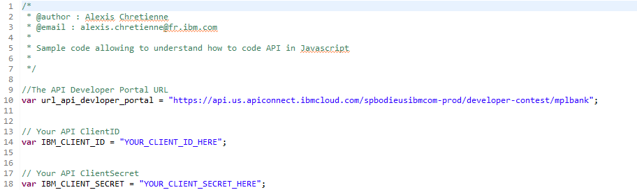

# Deploy a financial microservice using Red Hat OpenShift Container Platform (OCP) on Linux on Z 

In this lab, you will experience how a traditional z/OS transaction can be modernized by creating services (APIs) that can be assessed by a hybrid cloud banking application.   This web application will be deployed using OpenShift and the workload runs on OCP cluster on System Z Linux.

You will perform the following tasks:

* Use the IBM API Portal to connect to a set of z/OS banking services. 
* Modify a web application to access the z/OS banking services. 
* Use node.js to build and test the web application on your laptop. 
* Build, deploy, and test the web application on OCP.
* Use OCP to modify the web application and redeploy the changes.

# Architecture

This lab accesses a fictitious retail banking system called MPLbank. MPLbank integrates an Account Management System running on IBM Mainframe. On top of this component, an API layer based on z/OS Connect Enterprise Edition and IBM API Connect has been set up to deliver banking APIs. It makes banking services reachable through APIs from all kind of applications. 

1. The user deploys a Docker image (banking application based microservice) to the OCP.  
2. The user configures and runs a container based on this Docker image. Once started, the application calls banking APIs published in API Connect.
3. API Connect calls the back-end Z Mainframe through a banking API published in z/OS Connect EE.
4. z/OS Connect EE calls the Account Management System (AMS) running in CICS. A COBOL program processes the request and returns banking data. Finally, banking data are sent back to the microservice application.

# Included components

* [Red Hat OpenShift Container Platform](https://www.openshift.com)
* [IBM API Connect](http://www-03.ibm.com/software/products/en/api-connect)
* [IBM z/OS Connect Enterprise Edition](https://www.ibm.com/us-en/marketplace/connect-enterprise-edition)
* [IBM CICS Tansaction Server](https://www.ibm.com/us-en/marketplace/cics-transaction-server#product-header-top)
* [IBM Db2](https://ed www.ibm.com/analytics/db2/zos)

# Featured technologies

* [Docker](https://www.Docker.com/)
* [Microservices](https://www.ibm.com/cloud/garage/architectures/microservices/)
* [IBM LinuxONE](https://www.ibm.com/it-infrastructure/LinuxONE)
* [IBM Z Mainframe](https://www.ibm.com/it-infrastructure/z)

# Steps

### Step 1 - Discover and locally run the banking application

- [Part 1 - Discover the banking application]
- [Part 2 - Subscribe to the banking API through the API Developer Portal]
- [Part 3 - Run the banking application with Node.js]
- [Part 4 - Push the banking application to your GitHub repository]

### Step 2 - Deploy the banking microservice from OCP

- [Part 1 - Using the OCP tool to deploy the banking application using a dockerfile].
- [Part 2 - Access your banking microservice].
- [Part 3 - Modify your banking microservice and redeploy it].
---

# Step 1 - Discover and locally run the banking application

## Part 1 - Discover the banking application

1. Launch a terminal and clone your GitHub repository *banking-app-xx* to create a local copy of your banking application, where xx is your assigned ID number:

   `git clone https://github.com/zcloud-01/banking-app-xx`
    
2. Take a look at the imported *banking-app-xx* folder:

   `cd banking-app-xx`
   
   `dir or ls`
   
	* *app.js*: the application server code.
	* *public/index.html*: the application client code (banking dashboard).
	* *public/css*: the application stylesheet.
	* *public/js*: the JavaScript libraries. 
	* *public/js/bankingAPI.js* will be modified later to connect to a corebanking system through API calls.
	* *package.json*: the package dependencies file.
	* *Dockerfile*: file to build the Docker image. 

## Part 2 - Subscribe to the banking API through the API Developer Portal

1. Go to the [API Developer Portal].

2. Login to your account.

3. Create a new application.
	* Click **Apps** from the menu.
	* Click **Create new App**.
	* Fill in all the required fields.
	* For Title: use zcloudxx (e.g zcloud01). 
	* Click **Submit**.
	
3. Make a note of the following.  You can copy the information to notepad, for example. You will need this information later to access the API.
	
	* *client ID* 
	* *client Secret* 
	
	

4. Before working with the banking API, you need to subscribe to it first. Display the list of available API products.

	
	
	* Click **API Products** from the top menu.
	* Click **Banking Product** in the list.

5. Subscribe to the Banking API.

	
	
	* Click **Subscribe** to the Default Plan.
	
	
	
	* Select the App that you have just created before.
	* Click **Subscribe**.
	
6. Modify the *banking-app-xx/public/js/bankingAPI.js* file. You can use notepad, for example.

	
	
	* Replace *YOUR_CLIENT_ID_HERE* by your client ID value from the IBM API developer portal.
	* Replace *YOUR_CLIENT_SECRET_HERE* by your client Secret value from the IBM API developer portal.

## Part 3 - Run the banking application with Node.js

1. Go to your banking application folder:

    `cd banking-app-xx`

2. Install Node.Js package dependencies of the banking application:

    `npm install`
    
	
	
   * As a result, dependencies are installed in your project folder.

3. Run the banking application using:

    `node app.js`
    
	
	
   * As a result, The banking application is started.
	
4. Run your application:

    `Launch a web browser and enter the URL **localhost:3000**. 
    
   The banking application appears.
    
	

5. Test your application.

	
    
    * Select a customer ID.
    * The application accesses banking data from z/OS through API Connect.
    * The result is displayed in a JSON structure.
    
6. The banking application works locally. To stop the Node.js server: 
   
   Enter **CTRL+C** from the terminal.

## Part 4 - Push the banking application to your GitHub repository

1. Add the *bankingAPI.js* file you just modified to the current content index.

   `git add public/js/bankingAPI.js`

2. Commit the modified code to your local repository.

   `git commit -m "Update of bankingAPI.js"`

3. Push the code you commited to your local repository.

   `git push`

4. Go back to your online Github repository *banking-app-xx* using the web browser. 

	
	
	* Check that your code has been updated with the commit label *Update of BankingAPI.js*

---

:thumbsup: Congratulations! Your banking application locally works and modifications have been pushed to your GitHub repository! Ready for Red Hat OpenShift Container Platform?

---

# Step 2 - Build and deploy a Docker image to OCP

When using OpenShift there are a number of different ways you can add an application. We will use the method to Build and deploy from source code contained in a Git repository from a Dockerfile. 

1. Login to the OCP portal.

   From a web browser, enter the URL: https:console-openshift-console.apps.ocp.linuxone.io.
   
2. At the login screen, select **ldapidp**.

3. Enter your assigned username and password.

3. Create a project.

   * Click on **Project** and **Create Project**

   * Enter project name: **projectxx**.  *Important:  You must use this exact name with your assigned user number in the project name*
   * Click on **Create**
   

As the project is currently empty, no workloads should be found and you will be presented with various options for how you can deploy an application.

4. Import your Dockerfile from your git repository to be built and deployed.

   * Click the **From Dockerfile** tile.

6. Enter your git repo URL. 

   * **https://github.com/zcloud-01/banking-app-xx.git**

7. Change the Container Port to **3000**.

From the name of the repo, the Application Name and deployment Name fields will be automatically populated.
The deployment name is used in OpenShift to identify the resources created when the application is deployed. This will include the internal Service name used by other applications in the same project to communicate with it, as well as being used as part of the default hostname for the application when exposed externally to the cluster via a Route.
The Application Name field is used to group multiple deployments together under the same name as part of one overall application.

At the bottom of this page you will see that the checkbox for creating a route to the application is selected. This indicates that the application will be automatically given a public URL for accessing it.

8. Click on **Create**.

This will return you to the Topology view, but this time you will see a representation of the deployment, rather than the options for deploying an application.

You may see the colour of the ring in the visualisation change from white, to light blue and then blue. This represents the phases of deployment as the container for the application starts up.

When the deployment complent, you will see a green check mark indicating that the deployment was successful. 

9. Access the application.

You can access the application via its public URL, by clicking on the URL shortcut icon on the visualisation of the deployment.

 
10. Test your application.

	
    * Select a customer ID.
    * Please wait while the application calls banking data from the Mainframe through API Connect and z/OS Connect EE.
    * The result is displayed in a JSON structure.

:thumbsup: Congratulations! You have suucessfully deployed your banking application to run on the OCP cluster on System Z Linux server. 

---

# Licence

This code pattern is licensed under the Apache Software License, Version 2.  Separate third party code objects invoked within this code pattern are licensed by their respective providers pursuant to their own separate licenses. Contributions are subject to the [Developer Certificate of Origin, Version 1.1 (DCO)](https://developercertificate.org/) and the [Apache Software License, Version 2](http://www.apache.org/licenses/LICENSE-2.0.txt).

[Apache Software License (ASL) FAQ](http://www.apache.org/foundation/license-faq.html#WhatDoesItMEAN)

# Links

[API Developer Portal]: https://developer-contest-spbodieusibmcom-prod.developer.us.apiconnect.ibmcloud.com/
