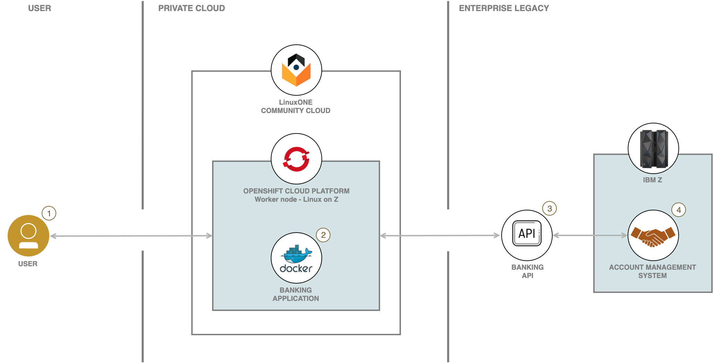
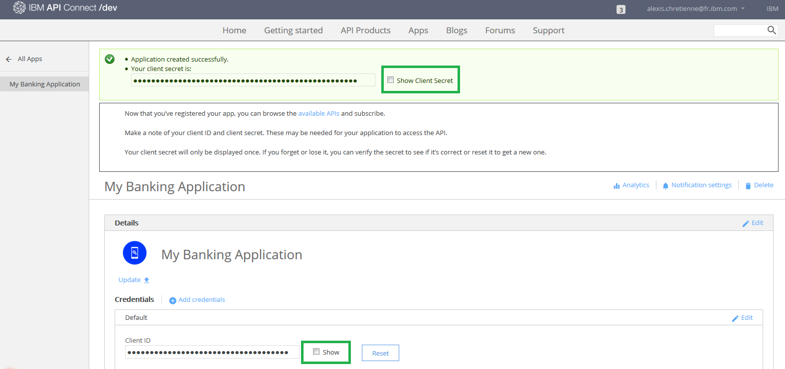
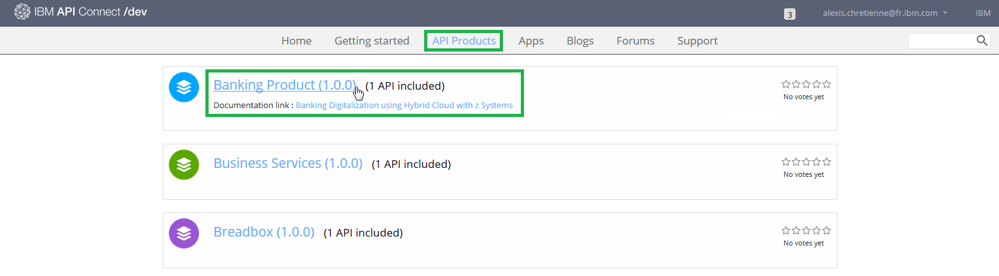
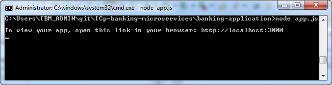
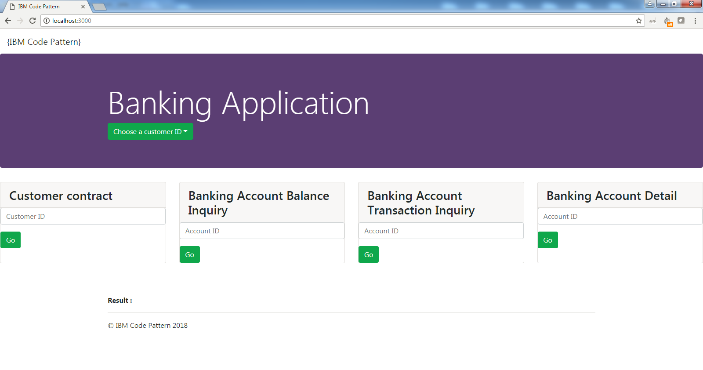
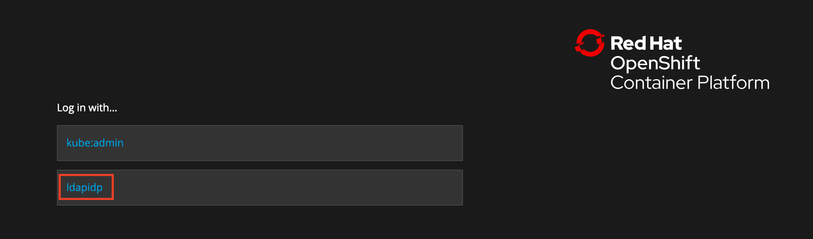
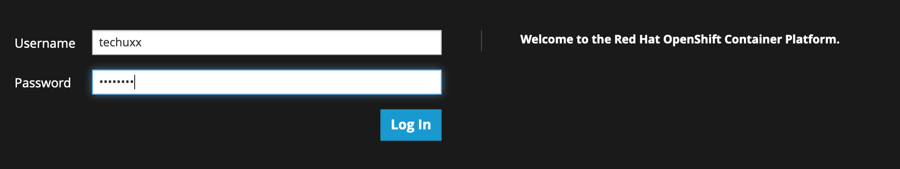
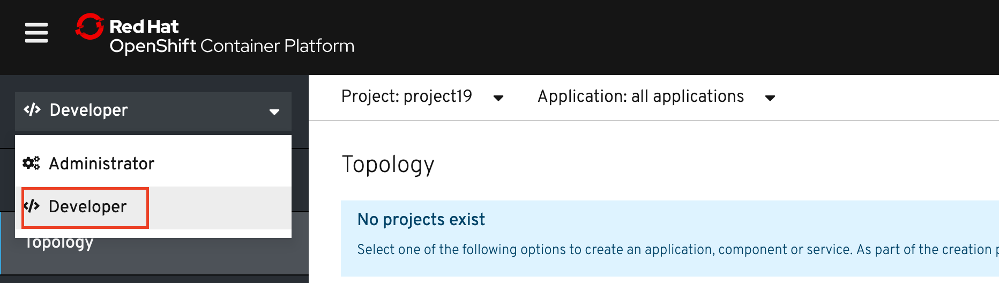

# Deploy a financial microservice using Red Hat OpenShift Container Platform (OCP) on Linux on Z 

In this lab, you will learn how a traditional z/OS banking transaction can be modernized and transformed into services (APIs) that can be assessed by a hybrid cloud web application.   This application will be deployed using OCP tools and the workload will run on the OCP cluster residing on System Z Linux.

You will perform the following tasks:

1. Use the IBM API Portal to subscribe and connect to the set of z/OS banking services for this lab. 
2. Use your workstation to access your github repository containing the web application locally.  Update the source code with the appropriate credentials required to access the z/OS banking services.  Use node.js to build and test the web application. 
3. Use the OCP web console to build and deploy the the web application from github.

# Architecture

This lab accesses a fictitious retail banking system called MPLbank. MPLbank integrates an Account Management System running on IBM Mainframe. On top of this component, an API layer based on z/OS Connect Enterprise Edition and IBM API Connect has been set up to deliver banking APIs. It makes banking services reachable through APIs from all kind of applications. 

<kbd></kbd>

1. The user deploys a Docker image (banking application based microservice) to the OCP.  
2. The user configures and runs a container based on this Docker image. Once started, the application calls banking APIs published in API Connect.
3. API Connect calls the back-end Z Mainframe through a banking API published in z/OS Connect EE.
4. z/OS Connect EE calls the Account Management System (AMS) running in CICS. A COBOL program processes the request and returns banking data. Finally, banking data are sent back to the microservice application.

# Included components

* [Red Hat OpenShift Container Platform](https://www.openshift.com)
* [IBM API Connect](http://www-03.ibm.com/software/products/en/api-connect)
* [IBM z/OS Connect Enterprise Edition](https://www.ibm.com/us-en/marketplace/connect-enterprise-edition)
* [IBM CICS Tansaction Server](https://www.ibm.com/us-en/marketplace/cics-transaction-server#product-header-top)
* [IBM Db2](https://www.ibm.com/analytics/db2/zos)

# Featured technologies

* [Docker](https://www.Docker.com/)
* [Microservices](https://www.ibm.com/cloud/garage/architectures/microservices/)
* [IBM LinuxONE](https://www.ibm.com/it-infrastructure/LinuxONE)
* [IBM Z Mainframe](https://www.ibm.com/it-infrastructure/z)

# Step 1 - Discover and run the banking application locally

## Part 1 - Discover the banking application

1. Locate your assigned ID number: ________________.

2. Locate your assigned git repository: _______________________________.

3. Launch a terminal (or command prompt in Windows).

4. Clone your git repository to create a local copy of your banking application.  Replace xx with your assigned ID number.

   `git clone https://github.com/zcloud-01/banking-app-xx`
    
5. Examine the directory structure of your imported repository.

   `cd banking-app-xx`
   
   `ls (or dir for Windows)`
   
   * **app.js** - Application server code
   * **public/index.html** - Application client code (banking dashboard)
   * **public/css** - Application stylesheet
   * **public/js** - JavaScript libraries 
   * **public/js/bankingAPI.js** - Source code that connects to a core banking system through API calls. You will modify this file later. 
   * **package.json** - Package dependencies file
   * **Dockerfile** - File to build the Docker image 

## Part 2 - Subscribe to the banking API through the API Developer Portal

1. Locate your assigned API Developer Portal account and password. 

2. Start a web browser.

3. Go to the API Developer Portal, https://developer-contest-spbodieusibmcom-prod.developer.us.apiconnect.ibmcloud.com/

4. Login to your assigned account.

3. Create a new application.
   
   * Click **Apps** from the menu.
   
   * Click **Create new App**.
   
   * Fill in all the required fields. For Title: use **myappxx**.  Replace xx with your assigned ID number.
   
   * Click **Submit**.
	
3. Make a note of the following.  For Windows, you can copy this information to notepad or sticky notes, for example. You will need this information later to access the API.
	
   * **client ID** 
   * **client Secret** 
	
   <kbd></kbd>

4. Before working with the banking API, you need to subscribe to it first. Display the list of available API products.

   <kbd></kbd>
	
   * Click **API Products** from the top menu.
   * Click **Banking Product** in the list.

5. Subscribe to the Banking API.

   <kbd></kbd>
	
   * Click **Subscribe** to subscribe to the *Default Plan*.
	
   <kbd></kbd>
	
   * Select the App that you have just created, **myappxx**.
	
   * Click **Subscribe**.
	
6. Return to the workstation terminal (or Command prompt)

7. Modify the *banking-app-xx/public/js/bankingAPI.js* file. You can use notepad, for example.

   * Replace **YOUR_CLIENT_ID_HERE** with your client ID value from the IBM API developer portal.
   
   * Replace **YOUR_CLIENT_SECRET_HERE** with your client Secret value from the IBM API developer portal.

   <kbd></kbd>
	
   
## Part 3 - Run the banking application with Node.js

1. Go to your banking application folder (if you are not already there)'.

   `cd banking-app-xx`

2. Install the Node.Js package dependencies of the banking application.

   `npm install`
    
   <kbd></kbd>

3. Start the banking application.

   `node app.js`
    
   <kbd></kbd>
	
4. Run your application.

   * Launch a web browser and enter the URL **localhost:3000**. 
    
   <kbd></kbd>

5. Test your application.

   <kbd></kbd>
    
   * Select a customer ID.
    
   * The application accesses banking data from z/OS through API Connect.
   
   * The result is displayed in a JSON structure.
    
6. You have successfully tested the banking application running locally. Stop the Node.js server. 
   
   Enter **CTRL+C** from the terminal.

## Part 4 - Update the banking application repository in GitHub

1. Add the *bankingAPI.js* file you just modified to the current content index.

   `git add public/js/bankingAPI.js`

2. Commit the modified code to your local repository.

   `git commit -m "Update of bankingAPI.js"`

3. Push the code you commited to your GitHub repository.

   `git push`
   
   * When prompted for a password, enter _______________.

4. Return to your web browser and go to your GitHub repository.

   <kbd></kbd>
	
   * Check that your code in the *bankingAPI.js* file has been updated with the commit label *Update of BankingAPI.js*.

---

:thumbsup: Congratulations! Your banking application locally works and modifications have been pushed to your GitHub repository! Ready for Red Hat OpenShift Container Platform?

---

# Step 2 - Build and deploy the banking application with OCP

When using OpenShift there are a number of different ways you can add an application. We will use the method to Build and deploy from source code contained in a Git repository from a Dockerfile. 

## Part 1 - Build and deploy a docker imager from GitHub  

1. Locate your assigned OCP portal user and password.

1. Login to the OCP portal with your assigned user and password.

   * From a web browser, enter the URL: https://console-openshift-console.apps.ocp.linuxone.io.
   
2. At the login screen, select **ldapidp**.

   <kbd></kbd>

3. Enter your assigned username and password.

   <kbd></kbd>

4. (If necessary) Select the Developer perspective for the project instead of the Adminstrator perspective 
  
   * Select **Developer** in the left hand side menu. 

   <kbd></kbd>

5. Create a project.

   * Click on **Project** and **Create Project**

   <kbd></kbd>

   * Enter project name: **projectxx**.  *Important:  You must use this exact name with your assigned user number in the project name*
   * Click on **Create**
   
   <kbd></kbd>

As the project is currently empty, no workloads should be found and you will be presented with various options for how you can deploy an application.

6. Import your Dockerfile from your git repository to be built and deployed.

   * Click the **From Dockerfile** tile.

   <kbd></<kbd>

7. Enter your git repo URL. 

   * **https://github.com/zcloud-01/banking-app-xx.git**

8. Change the Container Port to **3000**.

   <kbd></kbd>

   From the name of the repo, the Application Name and deployment Name fields will be automatically populated. The deployment name is used in OpenShift to identify the resources created when the application is deployed. This will include the internal Service name used by other applications in the same project to communicate with it, as well as being used as part of the default hostname for the application when exposed externally to the cluster via a Route. The Application Name field is used to group multiple deployments together under the same name as part of one overall application.

At the bottom of this page you will see that the checkbox for creating a route to the application is selected. This indicates that the application will be automatically given a public URL for accessing it.

9. Click on **Create**.

   This will return you to the Topology view, but this time you will see a representation of the deployment, rather than the options for deploying an application.

   <kbd></kbd>

   You may see the colour of the ring in the visualisation change from white, to light blue and then blue. This represents the phases of deployment as the container for the application starts up.

   When the deployment is complete, you will see a green check mark indicating that the deployment was successful. 

   <kbd></kbd>

10.Access the application.

   You can access the application via its public URL, by clicking on the URL shortcut icon on the visualisation of the deployment.

   <kbd></kbd>

11.Test your application.

   <kbd></kbd>
	
    * Select a customer ID.
    * Please wait while the application calls banking data from the Mainframe through API Connect and z/OS Connect EE.
    * The result is displayed in a JSON structure.

:thumbsup: Congratulations! You have suucessfully deployed your banking application to run on the OCP cluster on System Z Linux server. 

---

# Licence

This code pattern is licensed under the Apache Software License, Version 2.  Separate third party code objects invoked within this code pattern are licensed by their respective providers pursuant to their own separate licenses. Contributions are subject to the [Developer Certificate of Origin, Version 1.1 (DCO)](https://developercertificate.org/) and the [Apache Software License, Version 2](http://www.apache.org/licenses/LICENSE-2.0.txt).

[Apache Software License (ASL) FAQ](http://www.apache.org/foundation/license-faq.html#WhatDoesItMEAN)

# Links

[API Developer Portal]: https://developer-contest-spbodieusibmcom-prod.developer.us.apiconnect.ibmcloud.com/
